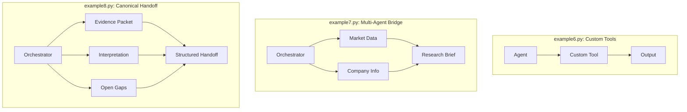

# next-gen-agentic-finance

**Layer 1 research intelligence: public/demo-data retrieval, bounded synthesis, and structured handoffs for human review.**

Built with Agno, OpenAI, Tavily, yfinance, Python 3.13

---

## What This Is

A pedagogical demonstration of agentic research workflows for finance. Each example adds one pattern — from static prompts to custom tools to multi-agent orchestration with structured handoffs for human review.

**Scope:** Not a trading system, not backtesting, not execution. Read-only tools, public data, human decision-making required.

**Entry point:** Start with `example8.py` (canonical pattern) or `example0_setup_check.py` (full progression).

---

## Core Patterns

Examples 6, 7, and 8 show three levels of agent coordination:



---

## Quick Start

**Requirements:** Python 3.13 and [uv](https://docs.astral.sh/uv/)

```bash
git clone https://github.com/FranQuant/next-gen-agentic-finance.git
cd next-gen-agentic-finance

uv venv --python 3.13 .venv
source .venv/bin/activate
uv sync

# Optional: MCP transport for example9
uv sync --extra example9

# Verify
uv run examples/example0_setup_check.py
```

**Environment Variables:**
```bash
cp .env.example .env
```

| Variable | Required for |
|---|---|
| `OPENAI_API_KEY` | examples 1–9 |
| `TAVILY_API_KEY` | examples 2–4 and 7–9 |
| `EXAMPLE9_TAVILY_MCP_URL` | example9 (remote MCP) |

---

## Example Progression

| Example | Pattern | Introduces |
|---|---|---|
| `example0` | Sanity check | Verifies Agno installation (no API calls) |
| `example1` | Prompt-only | Structured sentiment analysis, no tools |
| `example2` | Tool-enabled | Live news retrieval via Tavily |
| `example3` | Debug | `debug_mode=True` for tool introspection |
| `example4` | Interactive | Ad hoc analyst CLI |
| `example5` | Structured data | DuckDB queries over local CSV |
| `example6` | Custom tools | @tool decorator, pure function → agent |
| `example7` | Multi-agent | Orchestrator + 2 specialists |
| `example8` | **Canonical** | **Evidence → Interpretation → Gaps** |
| `example9` | MCP issuer | Remote Tavily transport, credit research |

---

## Where to Start

- **Canonical pattern** → `example8.py`
- **Full sequence** → Run examples 0–9 in order
- **Multi-agent orchestration** → `example7.py`
- **Custom tools** → `example6.py`

---

## Stack

| Component | Role |
|---|---|
| [Agno](https://github.com/agno-agi/agno) | Agent & multi-agent orchestration |
| OpenAI Responses API | LLM backend |
| [Tavily](https://tavily.com) | Live web & news retrieval |
| yfinance | Market data, fundamentals, analyst records |
| DuckDB / CsvTools | SQL queries over local structured data |
| MCP (optional) | Remote Tavily transport (example9 only) |

---

## Shared Tool Layer

`examples/finance_tools.py` provides read-only helpers across all examples:

- `get_current_stock_price` — price, OHLCV, session timing
- `get_analyst_recommendations` — analyst stance & recommendation records
- `get_company_info` — fundamentals, sector, valuation ratios
- `get_company_news` — yfinance news feed
- `get_company_news_tavily` — deduplicated, quality-scored news via multi-query strategy

*This is a demo utility module, not a production SDK.*

---

## Governance

- ✓ Read-only tools
- ✓ Public/demo data only
- ✓ Human review required
- ✓ No autonomous action
- ✗ No execution, trading, or capital-management workflows

---

## Repository Structure

```
next-gen-agentic-finance/
├── data/
│   └── latamstocks.csv          # LatAm equities dataset (example5)
├── examples/
│   ├── finance_tools.py         # Shared tool layer
│   ├── news_filter.py           # News scoring & filtering
│   ├── example0_setup_check.py
│   ├── example1.py  →  example9.py
├── README.md
├── pyproject.toml
└── uv.lock
```

---

## Disclaimer

For research and educational purposes only. Nothing in this codebase constitutes investment advice. All examples are bounded demonstrations — not deployable investment infrastructure.
