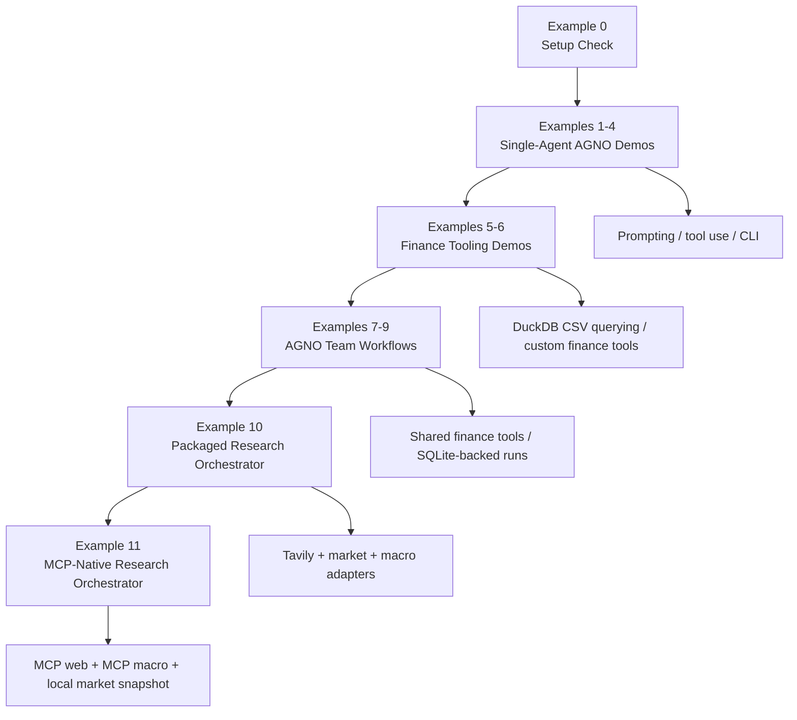
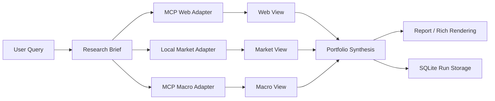

# Agentic Finance Examples

A compact repository of agentic finance research examples, progressing from simple AGNO demos to packaged research orchestrators with adapters, persistence, and reporting.

The repository currently combines:

- AGNO agents and teams
- OpenAI Responses models
- Tavily search
- yfinance market and company data
- DuckDB-backed CSV querying
- SQLite-backed run history
- MCP-based web and macro adapters in `example11`

The examples are intentionally small, but the later ones are better understood as architecture demos than as single-file toy scripts.



## Repository Purpose

This repo is not a production trading system. It is a reference library for:

- agent orchestration patterns
- tool-calling in finance-oriented workflows
- market and company data retrieval
- compact research pipelines
- adapter and orchestrator design
- reporting and run persistence

## 1. Setup

This project uses `uv`.

```bash
uv sync
source .venv/bin/activate
```

Minimal sanity check:

```bash
python examples/example0_setup_check.py
```

Expected output:

```text
Agno demo environment setup successful.
Agent name: FS
```

## 2. Environment Variables

Create a `.env` file in the project root when you want to run the networked examples:

```bash
OPENAI_API_KEY=your_key_here
TAVILY_API_KEY=your_key_here
FRED_API_KEY=your_key_here
```

Notes:

- `OPENAI_API_KEY` is required for the AGNO/OpenAI demos in examples `1` through `9`. It is not used by `example10` or `example11`.
- `TAVILY_API_KEY` is used by Tavily-backed search and news flows in examples `2`, `3`, `4`, `7`, `9`, and `10`.
- In `example11`, `TAVILY_API_KEY` is optional. If present, it can be used to infer a live Tavily MCP web endpoint when explicit MCP web server settings are not provided.
- `FRED_API_KEY` is optional for live macro data in `example10`.
- In `example11`, `FRED_API_KEY` is optional. If present, it can be used to infer the bundled local macro MCP server; otherwise `example11` can still run with explicit MCP configuration or fallback behavior.
- `example10` and `example11` can run without `OPENAI_API_KEY`. Both examples report fallback or degraded behavior explicitly when live external evidence is unavailable.

## 3. Example Progression

### Example 0 - Setup Check

**File:** `examples/example0_setup_check.py`

Minimal AGNO installation and environment sanity check.

Run:

```bash
python examples/example0_setup_check.py
```

### Example 1 - Fixed-Headline Sentiment Demo

**File:** `examples/example1.py`

Single-agent sentiment scoring over a fixed set of sample finance headlines.

Run:

```bash
uv run examples/example1.py
```

### Example 2 - Tavily-Backed Sentiment Demo

**File:** `examples/example2.py`

Extends the sentiment task with live Tavily search results.

Run:

```bash
uv run examples/example2.py
```

### Example 3 - Tool-Visible Sentiment Demo

**File:** `examples/example3.py`

Tool-enabled sentiment scoring with visible tool execution and debug-style transparency.

Run:

```bash
uv run examples/example3.py
```

### Example 4 - Interactive CLI Sentiment Agent

**File:** `examples/example4.py`

Interactive CLI version of the Tavily-backed sentiment agent.

Run:

```bash
uv run examples/example4.py
```

### Example 5 - LatAm CSV Assistant

**File:** `examples/example5.py`

LatAm equities CSV assistant using DuckDB SQL through AGNO CSV tools.

Run:

```bash
uv run examples/example5.py
```

### Example 6 - Options Maximum-Pain Tool Demo

**File:** `examples/example6.py`

Custom maximum-pain options tool built on top of yfinance option chains.

Run:

```bash
uv run examples/example6.py
```

### Example 7 - Two-Member Research Team

**File:** `examples/example7.py`

AGNO research team that combines shared finance tools from `examples/finance_tools.py` into a stock research brief.

Run:

```bash
uv run examples/example7.py
```

### Example 8 - Persistent Institutional Memo Workflow

**File:** `examples/example8.py`

Persistent AGNO team with:

- `YFinanceTools`
- SQLite-backed team state in `tmp/team.db`
- explicit multi-step investment memo generation
- visible reasoning output

Run:

```bash
uv run examples/example8.py
```

### Example 9 - Compact Research-to-Portfolio Team

**File:** `examples/example9.py`

Compact AGNO workflow with:

- market-data agent
- strategist
- portfolio manager
- SQLite-backed run history in `tmp/research_team.db`

This is a strict compact-output demo, not an HTTP service.

Run:

```bash
uv run examples/example9.py
```

### Example 10 - Packaged Research Orchestrator

**Entry point:** `examples/example10/example10.py`

Packaged research orchestrator with:

- query-to-brief parsing
- Tavily evidence adapter
- yfinance market snapshot adapter
- FRED macro adapter
- Polymarket sentiment stub
- SQLite storage
- plain-text and Rich reporting modes

Run:

```bash
uv run examples/example10/example10.py "Analyze MSFT and NVDA for a 3-12 month portfolio view."
```

Plain-text report:

```bash
EXAMPLE10_PLAIN_REPORT=1 uv run examples/example10/example10.py
```

### Example 11 - MCP-Native Research Orchestrator

**Entry point:** `examples/example11/example11.py`

Flagship packaged orchestrator with:

- MCP web adapter
- MCP macro adapter
- local yfinance market snapshot adapter
- SQLite storage
- plain-text and Rich reporting
- explicit degraded-mode reporting when live MCP data is unavailable



Run:

```bash
uv run examples/example11/example11.py "Evaluate whether current macro conditions support an equity overweight."
```

Plain-text report:

```bash
EXAMPLE11_PLAIN_REPORT=1 uv run examples/example11/example11.py
```

`example11` configuration lives in `examples/example11/config.py`. Live MCP behavior is controlled with environment variables such as:

- `EXAMPLE11_USE_MCP_LIVE`
- `EXAMPLE11_MCP_WEB_SERVER_URL`
- `EXAMPLE11_MCP_WEB_SERVER_COMMAND`
- `EXAMPLE11_MCP_MACRO_SERVER_URL`
- `EXAMPLE11_MCP_MACRO_SERVER_COMMAND`

## 4. Shared Utility Layer

### `examples/finance_tools.py`

Shared finance tool layer used by the mid-repo AGNO examples. It currently provides:

- latest price snapshots
- analyst recommendations
- curated company info
- normalized company news from yfinance
- Tavily-backed company news retrieval

This file is best understood as a reusable demo tool boundary for examples such as `example7` and `example9`, rather than as a general-purpose production data library.

## 5. Current Repository Structure

```text
agentic_finance/
├── AGENTS.md
├── README.md
├── data/
│   └── latamstocks.csv
├── examples/
│   ├── example0_setup_check.py
│   ├── example1.py
│   ├── example2.py
│   ├── example3.py
│   ├── example4.py
│   ├── example5.py
│   ├── example6.py
│   ├── example7.py
│   ├── example8.py
│   ├── example9.py
│   ├── finance_tools.py
│   ├── example10/
│   │   ├── example10.py
│   │   ├── team.py
│   │   ├── config.py
│   │   ├── schemas.py
│   │   ├── adapters/
│   │   ├── agents/
│   │   └── services/
│   └── example11/
│       ├── example11.py
│       ├── team.py
│       ├── config.py
│       ├── schemas.py
│       ├── adapters/
│       ├── agents/
│       └── services/
├── pyproject.toml
├── tmp/
└── uv.lock
```

Runtime artifacts are written under `tmp/` and are not part of the core source tree.

## 6. Notes on the Current Architecture

The repo progression changes shape over time:

- **Examples 1-6** are mostly single-file AGNO demos.
- **Examples 7-9** are AGNO team orchestrations with shared tool layers.
- **Examples 10-11** move to packaged Python orchestrators with explicit adapters, schemas, storage, and reporting.

Because of that, the later examples are best read as architecture examples rather than as direct extensions of the earlier single-file demos.

Two practical notes:

- `example10` and `example11` use packaged deterministic classes named as "agents," but functionally they behave more like analyzers within an orchestrator stack.
- `example11` is designed to degrade safely when live MCP data is not available.

## 7. Validation

This repository does not currently ship a dedicated automated test suite.

Useful local checks:

```bash
python -m compileall examples
python examples/example0_setup_check.py
EXAMPLE10_PLAIN_REPORT=1 python examples/example10/example10.py
EXAMPLE11_PLAIN_REPORT=1 python examples/example11/example11.py
```

## 8. Where to Start

If you are new to the repo:

- start with `example0_setup_check.py`
- then read `example1.py` through `example4.py`
- jump to `example7.py` for the first meaningful team workflow
- read `example10` for the cleanest packaged orchestrator
- read `example11` for the flagship MCP-oriented architecture

## 9. Disclaimer

This repository is for research and educational use only. Nothing in this codebase or its outputs constitutes investment advice.
